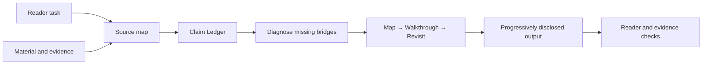

<div align="center">

# Semantic Decompression

**Restore the missing context, causality, authority, and state behind dense material, from a single sentence to a multi-document repository.**

<a href="./README.md">简体中文</a> · <strong>English</strong>

</div>

`semantic-decompression` is a reusable skill for agents and LLMs. It does not make difficult material shallow, and it does not create the appearance of explanation by adding more words. It preserves the source's facts, decisions, boundaries, and uncertainty, then restores the bridges that the author assumed, the expert omitted, or the model skipped.

The skill works on a compressed architecture statement, but it can also handle a repository in which README files, ADRs, specifications, code, reports, roadmaps, tickets, and research sources all describe different parts of the same project.

A typical request sounds like this:

> "I know the vocabulary, but I still cannot tell what this is doing. Explain it from zero without losing the formal terms or the rigor."

For a repository, the request may sound like this:

> "This is a repository snapshot. Orient a newcomer, identify which sources own which claims, separate current implementation from target state, and do not treat a roadmap or candidate claim as current truth."

## The problem it solves

High-entropy material is often difficult because the author and reader do not share the same context. Several relationships have been compressed into a small amount of text, while the reader lacks the local background needed to reconstruct them.

A short passage may omit:

- what a term means inside this project or organization;
- who proposes, approves, executes, observes, and owns the final decision;
- how A leads to C and which mechanism sits between them;
- how current, target, failure, and recovery states are ordered;
- a metric's denominator, baseline, time window, and evidentiary limits;
- the premises, exceptions, tradeoffs, and counterexamples behind a conclusion.

A repository adds four more sources of compression:

- **Authority entropy**: the README, semantic root, ADRs, code, reports, and roadmap all speak, but their ownership boundaries are unclear.
- **Provenance and freshness entropy**: the current tree, historical reports, dirty snapshots, overlays, manifests, and handoffs are mixed together.
- **Coverage entropy**: an answer sounds comprehensive even though only a few entry points were read.
- **Verification entropy**: file existence, implementation, a passing check, an accepted claim, and a shipped product are treated as the same state.

Semantic decompression restores these relationships so readers can move from their own starting point to the source's conclusion, understand how far the conclusion reaches, and know where to verify it.

## How it differs from nearby tasks

| Task | Main operation | Best suited for |
| --- | --- | --- |
| Summarization | Compress information | A long source that needs a quick overview |
| Translation | Change language | Complete content that needs cross-language expression |
| Editing | Improve expression | Complete meaning expressed in stiff, repetitive, or unnatural prose |
| Glossary | Define terms one by one | Readers who do not know the literal vocabulary |
| Repository inventory | List files and modules | Readers who need to know what exists in the tree |
| Semantic decompression | Restore implicit relationships, authority, and paths | Readers who can find the words and files but still cannot see how the whole works or what has actually been established |

## The core model

```text
A learnable explanation
= the reader's task
+ a truth skeleton with source boundaries
+ the missing comprehension bridges
+ a narrative path that can be followed and checked
```

The skill protects the source while restoring what understanding requires:

| Must be preserved | Must be restored |
| --- | --- |
| Facts, numbers, quotations, and original conclusions | Local context and hidden premises |
| Canonical terminology and critical distinctions | Actors, authority, and ownership |
| Constraints, boundary conditions, and exceptions | Causality, dependencies, and state changes |
| Uncertainty and strength of evidence | Running examples, failure paths, and practical consequences |
| The claim scope owned by each source type | Authority, freshness, coverage, and verification boundaries |

When a formal term first appears, the skill explains its role in plain language. Once the reader has a working intuition, it keeps using the canonical vocabulary so the reader can return to the source material and participate in the domain discussion.

## A single-document example

### Compressed source

> Runtime can only submit a Candidate. The Conversation owner decides the canonical Utterance against the accepted frontier; RunSignal is non-authoritative and may be lost.

### Semantically decompressed

After a response is generated, the `Runtime` can submit only a `Candidate`. A `Candidate` is a proposed result waiting for a decision. The conversation does not treat it as official yet.

The `Conversation owner` has final commit authority. The `accepted frontier` marks the latest conversation state the owner has accepted. The owner uses it to check whether the `Candidate` was produced against the current state. Only an accepted candidate becomes the `canonical Utterance`, which later reads and recovery procedures treat as the official message.

A `RunSignal` is only a notification that new progress may be available. It helps the interface and downstream components react quickly, but it does not decide whether a candidate becomes fact. If the signal is lost, an observer may see the result later, but the accepted state does not disappear. Recovery must reread authoritative state rather than infer truth from signal delivery.

## A repository example

Suppose one repository contains these statements:

```text
README: The Research Studio is ready
Product document: status = active-hypothesis
Current State: only scripted fixture replay is implemented
Static Report: only links and JSON files were checked
Proof State: candidate claims = 1, accepted claims = 0
Snapshot: dirty = true
```

A plain summary can easily collapse them into: "The project has completed its runtime and ships a Research Studio."

Semantic decompression first asks what each source is allowed to establish. The README is an entry point, not automatic authority for current implementation. The product document describes a target experience. Current State and code describe present capability. The static report proves only the checks it ran. Proof State says the claim has not been accepted. The dirty snapshot means the package is not a clean release state.

The resulting explanation keeps the claims separate:

- the project direction includes a Research Studio;
- the scripted fixture path exists and has limited local evidence;
- real-provider execution, a web UI, and production readiness remain unproven;
- the current claim is still a candidate;
- a newcomer should continue through governance, current-state, and evidence sources before making implementation claims.

That is the difference between repository-level semantic decompression and repeating the root README.

## How the skill works

`SKILL.md` organizes the work into eight connected steps:

1. **Lock the reader task**: establish what the reader knows and whether they need to understand, decide, execute, maintain, restate, or rewrite an entry point.
2. **Map the sources**: identify status and scope for a single document; for a corpus, inventory the material, discover the project's authority model, and define coverage.
3. **Build the truth skeleton**: separate facts, decisions, implementation, proposals, targets, hypotheses, history, inference, and unknowns. Maintain a Claim Ledger for load-bearing conclusions.
4. **Find the missing bridges**: inspect terminology, background, causality, relationships, authority, time, quantities, exceptions, terminology drift, and missing evidence.
5. **Choose the narrative order**: usually real-world problem, system map, running example, abstract model, current versus target, boundaries, and next actions.
6. **Restore the right bridge for each material type**: give concepts a local role, processes an action chain, decisions a tradeoff chain, research an evidence boundary, and repositories an authority and verification model.
7. **Produce progressive disclosure**: start with a one-screen model, then provide a real route, current state, deeper sources, and a concise coverage note.
8. **Run reader and evidence checks**: verify that a capable newcomer can restate the system, walk through a case, use the terms correctly, distinguish current from target, and locate the evidence.



## Repository and corpus mode

When the input is a repository, archive, or document collection, the skill adds five disciplines.

### 1. Discover project-local authority

Authority is scoped by question rather than reduced to one global ranking:

- a semantic root owns definitions and invariants;
- a current-state or SSoT document owns maintained current facts;
- an ADR owns an accepted decision;
- code, schemas, and tests own current implementation behavior;
- a report owns only the checks it actually executed and the stated claim ceiling;
- specifications, tickets, and roadmaps own scope, plans, and work state;
- research notes, product theses, and raw sources own hypotheses, direction, and provenance.

A semantic root cannot prove that code is complete. Code cannot silently rewrite a frozen semantic contract. A real conflict should be described as implementation non-conformance, not erased by choosing the more convenient source.

### 2. Maintain a Source Ledger

Every load-bearing conclusion should answer:

```text
What kind of statement is it?
Which source type owns that statement?
What is the strongest source?
What version, date, or dirty state applies?
Was it verified in this run?
What conflict or gap remains?
How strong should the final wording be?
```

### 3. Apply a Current-State Gate

The skill keeps these states separate:

```text
File exists != work is complete
Code exists != capability is verified
Static check passed != runtime behavior is established
Candidate Claim != Accepted Claim
Historical report passed != current snapshot still passes
Product direction is clear != product is shipped
```

When it is necessary and safe, the agent may run read-only checks. If a tool is unavailable, the environment does not match, or the command was not run, the output must say so.

### 4. State coverage

A multi-file answer should not imply that the whole repository was exhaustively reviewed. The skill records required sources, global searches, sampled areas, and uncovered material, then exposes a concise coverage boundary in the final output.

### 5. Control length with progressive disclosure

A newcomer orientation normally follows this shape:

```text
One-screen model
  -> one real route
  -> current facts and target state
  -> authority, open questions, and where to read next
```

A README remains an entry point. It should route readers into the knowledge base rather than copy the entire knowledge base into one file.

See [`references/repository-corpus-mode.md`](./references/repository-corpus-mode.md) for the full workflow.

## Sixteen entropy lenses

The original twelve lenses cover terminology, background, causality, relationships, actors and authority, time and state, abstraction level, epistemic status, quantities, referents, exceptions, and action.

Repository and corpus mode adds four more: authority, provenance and freshness, coverage, and verification.

See [`references/decompression-lenses.md`](./references/decompression-lenses.md) for the complete lens catalog, techniques, domain guidance, and miniature examples.

## What kinds of material it handles

| Content type | What decompression restores |
| --- | --- |
| Projects, systems, and architecture | Participants, authority, object lifecycles, end-to-end requests, normal flow, failure, and recovery |
| Repositories, archives, and knowledge bases | Authority, provenance, terminology mapping, current versus target state, verification, and the shortest onboarding path |
| Plans, strategy, and decisions | Goals, constraints, assumptions, selection criteria, costs, risks, and review conditions |
| Research, papers, and analysis | Research question, method, evidence, uncertainty, alternative explanations, and unsupported conclusions |
| Policies, rules, and contracts | Scope, triggers, approval authority, timing, exceptions, consequences, and remedies |
| Abstract theories and arguments | Central claim, premises, reasoning chain, key distinctions, objections, and scope |
| Metrics and business reports | Definitions, baselines, windows, cohorts, mechanisms, and correlation-versus-causation limits |
| Operating guides and procedures | Preconditions, reasons for each action, success signals, common deviations, recovery, and verification |

## When it should trigger

Use this skill when the goal is understanding, handoff, reliable restatement, or a source-aware entry point. Common signals include:

- "Decompress this without removing the formal terms."
- "Explain it from zero and build the global mental model first."
- "Restore the hidden premises, causal chain, and examples instead of defining terms one by one."
- "Walk through who triggers, who approves, when it takes effect, and how recovery works."
- "Explain what this research result supports and what it does not support."
- "This is a repository snapshot. Separate current implementation, target state, and evidence."
- "Rewrite the README from multiple sources, but discover authority and current state first."

Do not use it for:

- pure summarization, compression, or bullet extraction;
- direct translation, editing, tone changes, or proofreading;
- archive extraction, file listing, extension counts, or TODO search;
- code repair, chart generation, schema generation, or naming tasks;
- making prose more formal or concise for the same audience without rebuilding understanding.

See [`evals/trigger-eval.json`](./evals/trigger-eval.json) for routing examples.

## Installation

Place the complete directory inside an agent or LLM runtime that supports directory-based skills, and make sure the runtime discovers the root `SKILL.md` file:

```text
<your-skills-directory>/
└── semantic-decompression/
    ├── SKILL.md
    ├── README.md
    ├── README_EN.md
    ├── VERSION
    ├── CHANGELOG.md
    ├── LICENSE
    ├── references/
    │   ├── decompression-lenses.md
    │   └── repository-corpus-mode.md
    └── evals/
        ├── evals.json
        ├── repository-evals.json
        ├── trigger-eval.json
        └── fixtures/
```

Runtime-specific skill locations and loading conventions vary. Two requirements remain constant:

1. load `SKILL.md` as the entry point;
2. preserve the relative paths under `references/` and `evals/`.

## Usage

A complete request usually identifies the material, the target reader, and the task the reader must perform afterward.

### Single document

```text
Semantically decompress this architecture note for an engineer who is taking over the module.
Keep the canonical terms. Start with the system map, walk one request through normal flow
and crash recovery, then explain the boundaries that must not be broken.
```

### Repository onboarding

```text
Use semantic-decompression on this repository snapshot.
The reader has no historical context and needs to understand why the project exists,
how authority is divided, what is implemented today, what remains a roadmap,
and where to verify or begin work. Cite load-bearing source paths and state coverage.
```

### README rewrite grounded in a repository

```text
Build a Source Ledger and apply the Current-State Gate before rewriting the root README.
Keep the entry point short: identity, system map, current boundary, quickest start, and deep links.
Do not present a product hypothesis or candidate claim as a shipped capability.
```

## A successful output should let the reader answer

- What problem does this system, policy, decision, or argument solve?
- How do the main actors, objects, layers, or claims connect?
- What happens from beginning to end in one concrete case?
- What role does each canonical term play here?
- Which statements are facts, decisions, implementation, proposals, hypotheses, history, inference, or unknowns?
- What is current, and what is only a target?
- What are the main tradeoffs, failure modes, and recovery paths?
- Where can each load-bearing conclusion be checked?
- What should the reader do or read next?

## Evaluation

The repository includes three evaluation sets:

- [`evals/evals.json`](./evals/evals.json): 8 single-source quality scenarios across architecture, SaaS strategy, statistical research, policy, governance, product analysis, and model alignment.
- [`evals/repository-evals.json`](./evals/repository-evals.json): 4 repository and corpus scenarios covering authority, current state, README rewriting, missing evidence, and candidate-versus-accepted boundaries.
- [`evals/trigger-eval.json`](./evals/trigger-eval.json): 27 routing examples, including repository-mode positives and negatives for archive extraction, file statistics, and code repair.

[`evals/fixtures/example-repository`](./evals/fixtures/example-repository) is a synthetic regression fixture. It intentionally contains a stale README, a product hypothesis, a static report, a missing local-validation path, a dirty snapshot, and an unaccepted claim. The fixture tests whether a model can resist writing a fluent but false project narrative.

A useful evaluator should check whether the output:

1. preserves the source conclusion and its uncertainty;
2. restores actors, sequence, causality, and boundaries;
3. provides one concrete case that exercises the central concepts;
4. distinguishes source facts from explanatory inference;
5. follows the project's own authority model;
6. separates existence, implementation, verification, acceptance, and delivery;
7. states coverage and unverified scope;
8. avoids inventing missing information merely to make the story smoother.

## Repository structure

```text
semantic-decompression/
├── SKILL.md
├── README.md
├── README_EN.md
├── VERSION
├── CHANGELOG.md
├── LICENSE
├── references/
│   ├── decompression-lenses.md
│   └── repository-corpus-mode.md
└── evals/
    ├── evals.json
    ├── repository-evals.json
    ├── trigger-eval.json
    └── fixtures/
        └── example-repository/
```

## Design principles

- **Preserve before explaining.** Never turn a proposal into a fact or present an inference as source text.
- **Scope authority by question.** Semantics, implementation, product, research, and evidence have different owners.
- **Existence is not completion.** Files, code, checks, claims, and delivery are distinct states.
- **Give the reader a map before the walkthrough.** Reconnect the details to the whole afterward.
- **Let comprehension gaps determine length.** Each paragraph should restore a specific piece of context, relationship, or evidence boundary.
- **Respect an intelligent newcomer.** Keep the intellectual standard and supply the local context they have not yet acquired.
- **Keep the domain language.** Readers should finish able to use the canonical vocabulary and return to the original material.
- **State coverage.** Trust comes from a traceable scope, not from prose that sounds exhaustive.

## Boundaries and limitations

- The skill does not manufacture facts. When the source is incomplete, it labels illustrative examples, reasonable assumptions, and unknowns explicitly.
- Repository mode is not an automated code audit and does not guarantee that every file was read. It provides a semantic and evidentiary review with an explicit coverage boundary.
- Project commands should be inspected for dependencies and side effects before execution. Prefer read-only validation and do not run untrusted scripts by default.
- The skill improves comprehensibility without changing the evidence level or replacing legal, medical, financial, security, or other professional judgment.
- High-risk material must retain its original qualifications, sources, scope, and important exceptions.
- The reference files are on-demand diagnostic aids, not templates that must appear in every response.

## Contributing

Contributions are welcome: new entropy lenses, cross-domain examples, repository failure modes, and evaluation cases. A useful change should usually explain:

- which concrete comprehension gap it fixes;
- why the current workflow does not handle that gap reliably;
- at least one example that should trigger the skill;
- at least one nearby task that should not trigger it;
- for multi-source changes, preferably a minimal synthetic fixture.

## Version and license

See [`VERSION`](./VERSION) for the current version and [`CHANGELOG.md`](./CHANGELOG.md) for release notes.

This project is licensed under the [MIT License](./LICENSE).
