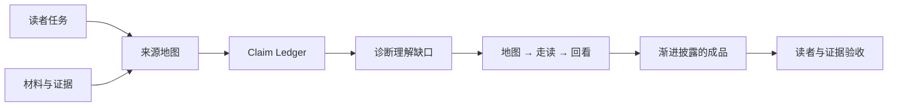

<div align="center">

# Semantic Decompression · 语义解压

**从一句高密度说明到一个多文档仓库，补回被省略的上下文、因果、权威和状态，让新人真正能接手。**

<strong>简体中文</strong> · <a href="./README.md">English</a>

</div>

`semantic-decompression` 是一个面向 Agent 和 LLM 的可复用 Skill。它不把复杂内容简单化，也不靠扩写制造“解释感”。它先守住来源中的事实、决定、边界和不确定性，再补回作者默认、专家省略、模型跳过的理解桥梁。

它既能处理一句压缩的架构说明，也能处理 README、ADR、白皮书、代码、报告、Roadmap 和 Ticket 混在一起的仓库素材包。

最典型的请求是：

> “这些词我都认识，但连起来不知道它在做什么。请从 0 到 1 讲清楚，术语和严谨性都要保留。”

或者：

> “这是一个仓库快照。请给空上下文新人讲清楚项目、权威来源、当前实现和目标状态，不要把 Roadmap 或 Candidate Claim 当成现状。”

## 它解决什么问题

高熵内容的困难通常不在词汇，而在上下文不对称。作者把很多关系压进了很少的表达里，读者却没有作者默认的背景。

一段短文本可能省略：

- 术语在当前项目里的本地含义；
- 谁提出、谁批准、谁执行，谁拥有最终决定权；
- A 为什么会导致 C，中间经过了什么机制；
- 当前、目标、失败和恢复状态怎样排列；
- 指标的分母、基线、时间窗口，以及它不能证明什么；
- 结论依赖的前提、例外、取舍和反例。

一个仓库还会多出四类问题：

- **Authority 熵**：README、白皮书、ADR、代码和报告都在说话，但各自能决定什么不清楚；
- **来源与时效熵**：当前树、历史报告、dirty snapshot、Overlay 和 Handoff 混在一起；
- **覆盖熵**：输出看起来完整，实际只读了几个入口；
- **验证熵**：文件存在、代码实现、检查通过、Claim 接受和产品交付被写成同一件事。

语义解压的目标是恢复这些关系，让读者能连续地从自己的起点走到原文结论，并知道结论成立到哪里、去哪里核对。

## 它和常见文本任务有什么不同

| 任务 | 主要动作 | 适合解决的问题 |
| --- | --- | --- |
| 摘要 | 压缩信息 | 原文太长，需要快速抓重点 |
| 翻译 | 更换语言 | 内容完整，只需要跨语言表达 |
| 润色 | 改善表达 | 原意完整，但句子生硬、重复或不自然 |
| 术语表 | 逐个定义名词 | 读者不知道某些词的字面含义 |
| 仓库目录摘要 | 罗列文件和模块 | 需要知道仓库里有什么 |
| 语义解压 | 恢复隐含关系、权威和路径 | 词都认识、文件也找得到，却看不懂整件事怎样成立、运行和被验证 |

## 核心工作模型

```text
可学习的解释
= 读者任务
+ 有权威边界的真相骨架
+ 被省略的理解桥梁
+ 一条可走、可核对的叙事路径
```

Skill 一边守住来源，一边恢复理解所需的内容：

| 必须守住 | 需要恢复 |
| --- | --- |
| 事实、数字、引用和原始结论 | 本地上下文与隐含前提 |
| 正式术语与关键区别 | 行动者、权限和所有权 |
| 约束、边界条件和例外 | 因果、依赖和状态变化 |
| 不确定性与证据强度 | 贯穿示例、失败路径和行动含义 |
| 各类来源拥有的陈述范围 | Authority、时效、覆盖和验证边界 |

术语第一次出现时，Skill 会用普通语言说明它在当前语境里的作用。读者建立直觉后，正文继续使用正式术语，方便其回到原始材料和项目讨论。

## 一个单文档示例

### 压缩表达

> Runtime 只能提交 Candidate，Conversation owner 基于 accepted frontier 决定 canonical Utterance；RunSignal 非权威且可丢失。

### 语义解压后的解释

一次回复生成后，`Runtime` 只能把结果提交为 `Candidate`。`Candidate` 是等待裁决的候选结果，此时还不是会话中的正式事实。

`Conversation owner` 拥有最终提交权。`accepted frontier` 标记 owner 已经接受的最新会话进度；owner 会据此检查 `Candidate` 是否仍基于当前状态。候选结果被接受后，才会成为 `canonical Utterance`。后续读取和恢复都以这条正式消息为准。

`RunSignal` 只是一条“有新进展”的通知。它能让界面和下游组件更快反应，但不参与裁决。信号丢失时，观察者可能晚一点看到结果，已经提交的权威状态不会消失。恢复时应重新读取已提交状态，不能根据是否收到 `RunSignal` 判断事实是否存在。

## 一个仓库素材包示例

假设同一个仓库里出现这些材料：

```text
README：Research Studio 已经可用
Product 文档：status = active-hypothesis
Current State：只实现 scripted fixture replay
Static Report：只做了链接和 JSON 检查
Proof State：candidate claims = 1，accepted claims = 0
Snapshot：dirty = true
```

普通摘要很容易把它们合并成一句：“项目已经完成运行时，并提供 Research Studio。”

语义解压会先问每份材料能决定什么：README 是入口，不自动拥有当前实现；Product 文档描述目标产品；Current State 和代码说明当前能力；Static Report 只证明静态检查；Proof State 说明结论还没有被接受；dirty snapshot 说明当前包不是一个干净、可直接复现的发布状态。

最终成品会把结论拆开：

- 项目方向包含 Research Studio；
- 当前只实现并局部验证了 scripted fixture 路径；
- Real provider、Web UI 和生产可用性尚未被证明；
- 现有 Claim 仍是 candidate；
- 接手者应从治理、当前状态和证据入口继续核对。

这就是仓库级语义解压与“读完 README 后复述”的区别。

## Skill 如何工作

`SKILL.md` 把任务组织为八个连续步骤：

1. **锁定读者任务**：确认读者现在知道什么，读完后要理解、判断、执行、维护，还是修改入口文档。
2. **画来源地图**：单文档识别状态和范围；仓库先盘点材料，找到项目自己的 Authority Ladder 和覆盖边界。
3. **建立真相骨架**：区分事实、决定、实现、建议、目标、假设、历史、推断和未知，并为承重结论维护 Claim Ledger。
4. **定位理解缺口**：检查术语、背景、因果、关系、权限、时间、数量、例外、术语漂移和缺失证据。
5. **安排叙事顺序**：通常采用“现实问题 → 全局地图 → 贯穿示例 → 抽象模型 → 当前与目标 → 边界与下一步”。
6. **按材料类型补桥**：概念补本地含义，流程补动作链，决策补取舍链，研究补证据边界，仓库补权威和验证。
7. **生成渐进披露的成品**：先给一屏全景，再给真实路线、当前状态、深层链接和覆盖说明。
8. **做读者与证据验收**：确认读者能复述整体、走通案例、正确使用术语、区分当前与目标，并找到核对入口。



## 仓库与多文档模式

当输入是仓库、压缩包或文档集合时，Skill 会额外执行五件事。

### 1. 先找项目自己的权威分工

Authority 不是一条全局排行榜，而是按问题域划分：

- 语义根拥有 Definition 和 Invariant；
- SSoT 或 Current Binding 拥有维护中的当前事实；
- ADR 拥有已采纳决定；
- 代码、Schema 和测试拥有当前实现行为；
- 报告只拥有实际执行过的检查和 Claim Ceiling；
- Spec、Ticket 和 Roadmap 拥有范围、计划和工作状态；
- Research、Product Thesis 和原始来源拥有假设、方向和来源背景。

白皮书不能证明代码完成，代码也不能静默改写白皮书。真正冲突应写成“实现不符合语义”，而不是挑一个方便的版本。

### 2. 维护 Source Ledger

每个承重结论都要能回答：

```text
它是什么陈述状态？
由哪类来源拥有？
最强来源是哪一份？
时间、版本和 dirty 状态是什么？
本次是否验证？
有什么冲突或缺口？
最终应该用多强的语气？
```

### 3. 运行 Current-State Gate

Skill 会守住这些区别：

```text
文件存在 != 工作完成
代码存在 != 能力经过验证
静态检查通过 != 运行时行为成立
Candidate Claim != Accepted Claim
历史报告通过 != 当前快照仍然通过
产品方向明确 != 产品已经交付
```

必要且安全时，可以运行只读检查。工具缺失、环境不满足或命令没有执行时，输出必须明确说明。

### 4. 声明覆盖范围

多文件输出不应制造“全仓库都审过”的错觉。Skill 会记录必读来源、全局搜索、抽样区域和未覆盖内容，并在成品中用简短方式说明。

### 5. 用渐进披露控制篇幅

仓库接手说明默认采用：

```text
一屏全景
  -> 一条真实路线
  -> 当前事实与目标状态
  -> 权威来源、未决问题和继续阅读
```

README 只承担入口职责，不把整个知识库复制进来。

完整流程见 [`references/repository-corpus-mode.md`](./references/repository-corpus-mode.md)。

## 16 类高熵镜头

单文档常见 12 类：术语、背景、因果、关系、行动者与权力、时间与状态、抽象层、认识状态、数量、指代、例外、行动。

仓库和多文档材料再增加 4 类：Authority、来源与时效、覆盖、验证。

完整诊断、常用手法、领域镜头和微型示例见 [`references/decompression-lenses.md`](./references/decompression-lenses.md)。

## 适合处理哪些内容

| 内容类型 | 解压时重点恢复 |
| --- | --- |
| 项目、系统与架构 | 参与者、权限、对象生命周期、端到端请求、正常路径、失败与恢复 |
| 仓库、压缩包与知识库 | Authority、来源状态、术语映射、当前与目标、验证和最短接手路径 |
| 方案、战略与决策 | 目标、约束、假设、选择标准、代价、风险和复盘条件 |
| 研究、论文与分析 | 研究问题、方法、证据、不确定性、替代解释和不能推出的结论 |
| 政策、规则与合同 | 适用对象、触发条件、审批权、时限、例外、后果和补救 |
| 抽象理论与论证 | 核心主张、前提、推理链、关键区分、反对意见和边界 |
| 指标与商业报告 | 口径、基线、时间窗口、分群、机制，以及相关与因果的区别 |
| 操作指南与流程 | 前置条件、动作原因、成功信号、常见偏差、恢复和验证 |

## 什么时候使用

当用户的目标是理解、接手、复述或建立可靠入口，而不是单纯把文字变短、变顺时，应该使用这个 Skill。常见表达包括：

- “去高熵化”“讲人话，但保留术语和严谨性”；
- “从 0 到 1 给新人讲清楚”“先建立全局心智模型”；
- “不要只给定义，补齐隐含前提、因果链和例子”；
- “按真实流程解释谁触发、谁审批、什么时候生效、失败怎么恢复”；
- “告诉我这段研究能证明什么、不能证明什么”；
- “这是一个仓库快照，区分当前实现、目标状态和证据”；
- “根据多份文档重写 README，先判断 Authority 和 Current State”。

这些任务不需要语义解压：

- 只要求摘要、压缩篇幅或提炼 bullet；
- 只要求直译、润色、改语气或校对；
- 只要求解压文件、列目录、统计扩展名或搜索 TODO；
- 直接修复代码、生成图表、创建 Schema 或起名字；
- 读者背景不变，只要求更正式或更简洁的表达。

触发边界见 [`evals/trigger-eval.json`](./evals/trigger-eval.json)。

## 安装

将完整目录放入支持目录型 Skill 的 Agent 或 LLM 运行时，确保根目录的 `SKILL.md` 能被发现：

```text
<your-skills-directory>/
└── semantic-decompression/
    ├── SKILL.md
    ├── README.md
    ├── README_ZH.md
    ├── VERSION
    ├── CHANGELOG.md
    ├── LICENSE
    ├── references/
    │   ├── decompression-lenses.md
    │   └── repository-corpus-mode.md
    └── evals/
        ├── evals.json
        ├── repository-evals.json
        ├── trigger-eval.json
        └── fixtures/
```

不同运行时的目录和加载方式可能不同，核心要求只有两个：

1. `SKILL.md` 作为入口文件被加载；
2. `references/` 与 `evals/` 的相对路径保持不变。

## 使用方式

Skill 可以自动路由，也可以显式调用。一个完整请求通常包含三项信息：材料、目标读者，以及读完后要完成的任务。

### 单文档

```text
请用 semantic-decompression 处理下面这段架构说明。
读者是刚接手模块的工程师；保留正式术语；先给全局地图，
再用一次真实请求走通正常路径和崩溃恢复，最后说明不能破坏的边界。
```

### 仓库接手

```text
请用 semantic-decompression 审视这个仓库快照。
读者没有历史上下文，需要理解项目为什么存在、Authority 怎样分工、
当前已经实现什么、哪些只是 Roadmap，以及从哪里开始验证和接手。
请提供承重来源路径，并说明本次没有覆盖的部分。
```

### 基于仓库改 README

```text
请先建立 Source Ledger 和 Current-State Gate，再重写根 README。
入口保持短，只讲定位、全景、当前边界、最短开始方式和深层链接；
不要把 Product Hypothesis 或 Candidate Claim 写成已交付能力。
```

## 合格的输出应让读者回答

- 这件事整体解决什么，为什么存在？
- 主要角色、对象、层级或观点怎样连接？
- 一次真实情况从开始到结束怎样发生？
- 正式术语在这里承担什么角色？
- 哪些是事实、决定、实现、建议、假设、推断、历史或未知？
- 当前状态与目标状态分别是什么？
- 主要取舍、失败方式和恢复路径是什么？
- 承重结论去哪里核对？
- 下一步应该做什么或读什么？

## 评测

仓库包含三类评测素材：

- [`evals/evals.json`](./evals/evals.json)：8 个单文档跨领域质量场景，覆盖架构、SaaS 战略、统计研究、政策、治理、产品分析和模型对齐；
- [`evals/repository-evals.json`](./evals/repository-evals.json)：4 个仓库与多文档场景，覆盖 Authority、Current State、README 重写、缺失证据和 Candidate/Accepted 边界；
- [`evals/trigger-eval.json`](./evals/trigger-eval.json)：27 个触发判断样例，包含仓库模式正例，以及解压文件、目录统计、代码修复等反例。

[`evals/fixtures/example-repository`](./evals/fixtures/example-repository) 是一个合成回归素材。它故意包含过期 README、产品假设、静态报告、缺失的本机验证路径、dirty snapshot 和未接受 Claim，用来测试模型是否会“流畅地写错”。

接入自己的 runner 时，建议至少检查：

1. 是否保留原始结论和不确定性；
2. 是否补出行动者、顺序、因果和边界；
3. 是否提供一个能走通核心概念的具体案例；
4. 是否区分来源事实与解释性推断；
5. 是否按项目自己的规则判断 Authority；
6. 是否区分存在、实现、验证、接受和交付；
7. 是否声明覆盖和未验证范围；
8. 是否没有为了叙事顺畅而发明材料中不存在的信息。

## 仓库结构

```text
semantic-decompression/
├── SKILL.md
├── README.md
├── README_ZH.md
├── VERSION
├── CHANGELOG.md
├── LICENSE
├── references/
│   ├── decompression-lenses.md
│   └── repository-corpus-mode.md
└── evals/
    ├── evals.json
    ├── repository-evals.json
    ├── trigger-eval.json
    └── fixtures/
        └── example-repository/
```

## 设计原则

- **先保真，再解释。** 不把提案写成事实，也不把推断伪装成来源原话。
- **Authority 按问题域判断。** 语义、实现、产品、研究和证据各自有所有者。
- **存在不等于完成。** 文件、代码、检查、Claim 和交付必须分开。
- **先给地图，再走案例。** 进入细节前知道方向，结束后能回到整体。
- **篇幅跟着理解缺口走。** 每一段都应补回一段具体的上下文、关系或证据边界。
- **尊重聪明的新手。** 不降低智力要求，只补足尚未拥有的本地背景。
- **保留领域语言。** 最终让读者学会正式术语，并能回到原始材料继续工作。
- **声明覆盖。** 输出的可信度来自可追踪范围，不来自无边界的完整语气。

## 边界与限制

- Skill 不会凭空补事实。来源不足时，应明确标注示意例子、合理假设和未知项。
- 仓库模式不是自动化代码审计，也不保证读取所有文件。它提供的是有覆盖说明的语义与证据审视。
- 运行项目命令前应检查依赖和副作用；默认优先只读验证，不执行不受信任的脚本。
- 它提高可理解性，但不改变证据等级，也不替代法律、医学、财务、安全等领域的专业判断。
- 高风险材料必须保留原始限定、来源、适用范围和重要例外。
- 两份 reference 是按需使用的诊断工具，不是每次都要逐项输出的模板。

## 贡献

欢迎提交新的高熵镜头、跨领域案例、仓库失败模式和评测样例。一个有价值的改动通常需要说明：

- 它修复了哪一种具体理解缺口；
- 为什么现有工作流不能稳定处理；
- 至少一个应该触发的例子；
- 至少一个相近但不该触发的反例；
- 对多来源改动，最好附一个最小合成 fixture。

## 版本与许可证

当前版本见 [`VERSION`](./VERSION)，变更记录见 [`CHANGELOG.md`](./CHANGELOG.md)。

本项目采用 [MIT License](./LICENSE)。
